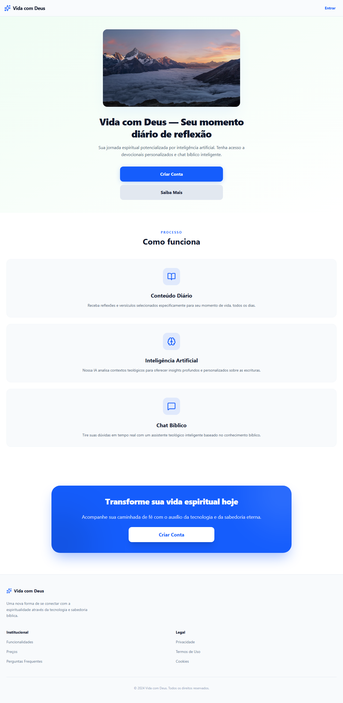
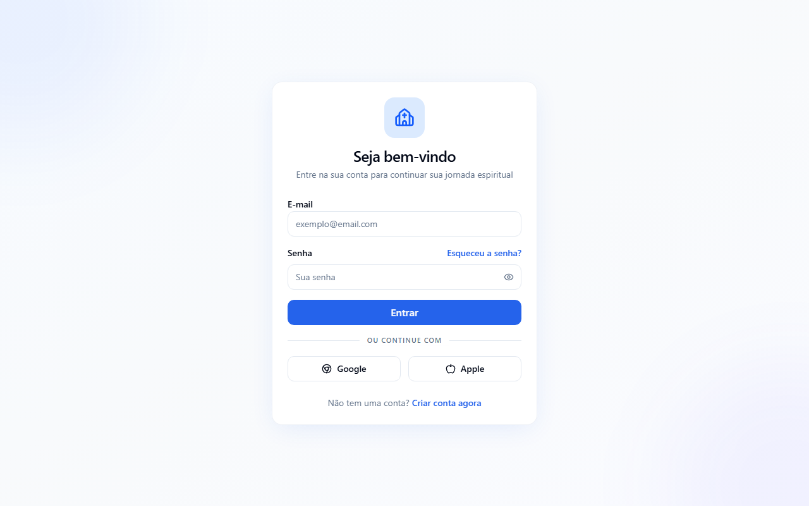
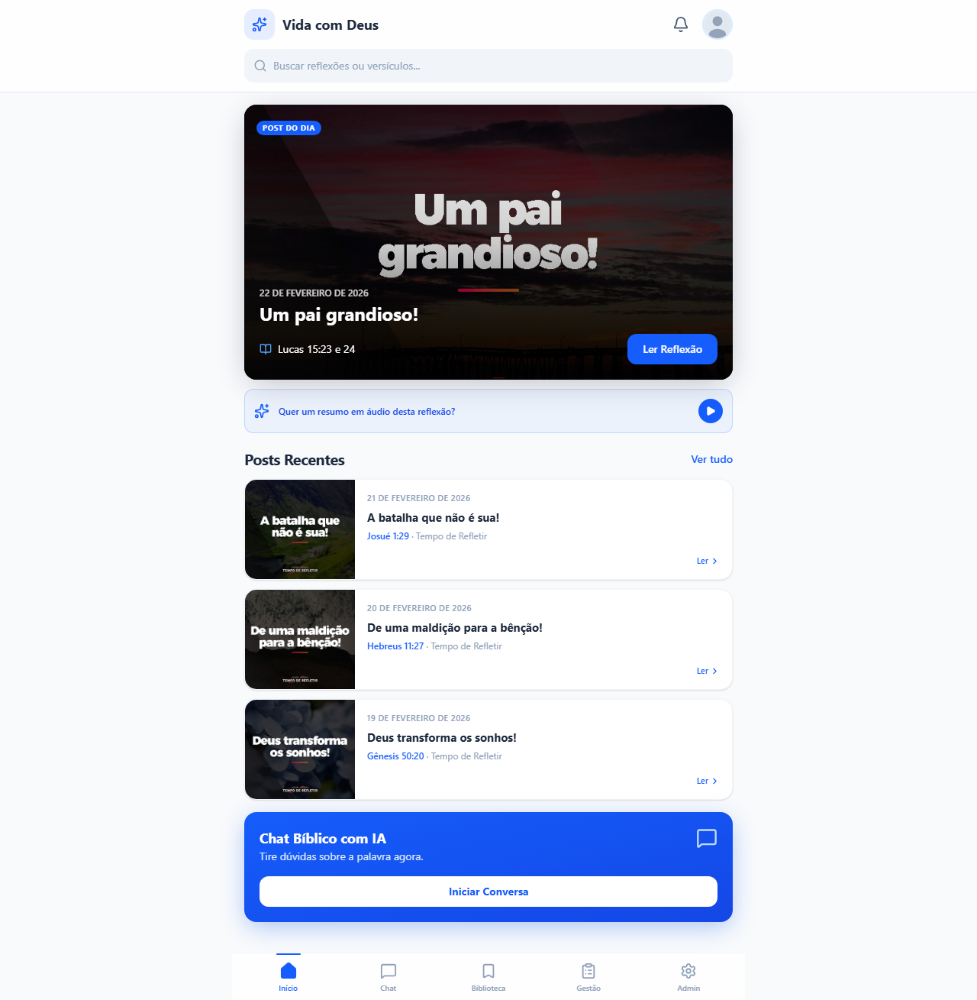
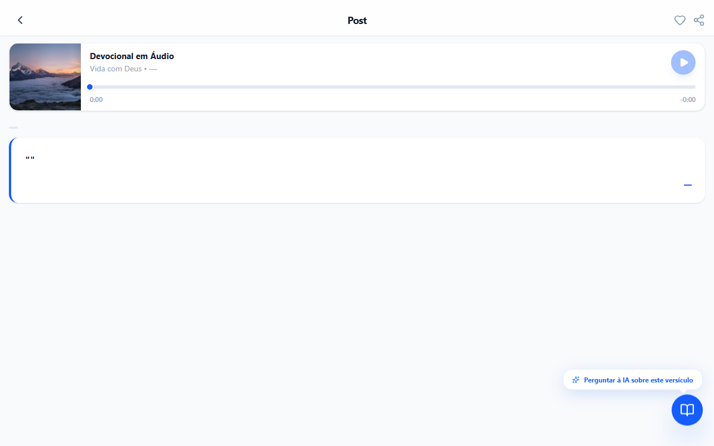
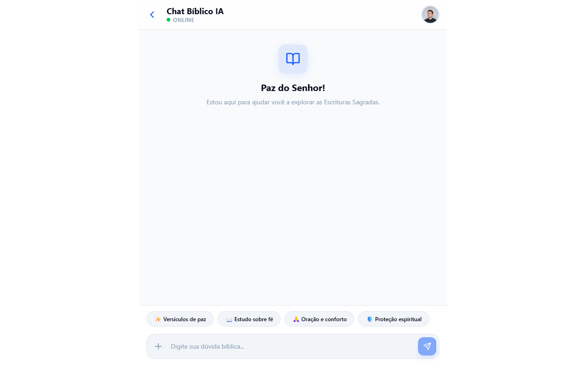
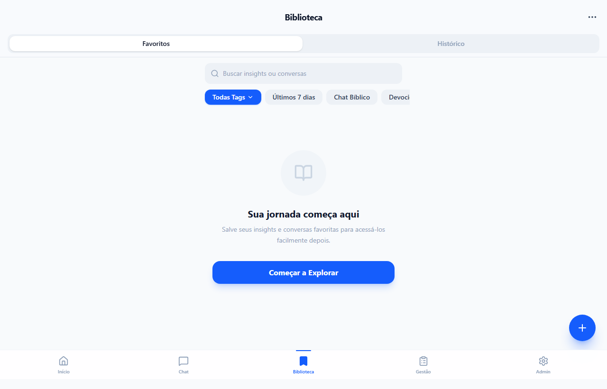
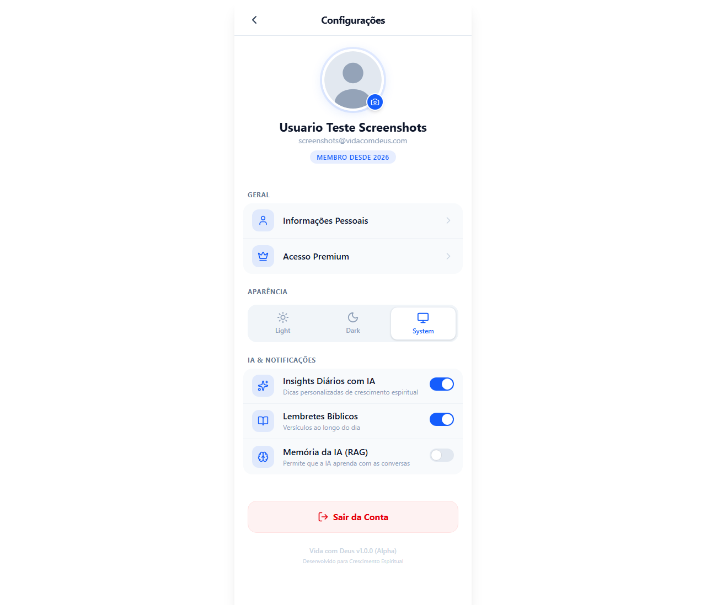
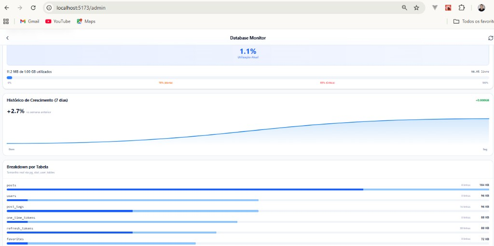

<div align="center">

# ✝️ Vida com Deus

**Aplicação web devocional full stack com feed de conteúdo bíblico, chat com IA e biblioteca pessoal — React 19 no front-end e FastAPI no back-end.**

[](https://react.dev/)
[](https://www.typescriptlang.org/)
[](https://fastapi.tiangolo.com/)
[](https://www.python.org/)
[](https://tailwindcss.com/)

</div>

---

## 📖 Sobre o Projeto

**Vida com Deus** é uma plataforma devocional que entrega conteúdo bíblico diário com apoio de inteligência artificial. Os usuários acessam o post do dia, interagem com um chat bíblico contextualizado e mantêm uma biblioteca pessoal de favoritos e histórico de leituras.

O projeto nasceu como um frontend Vue.js e passou por uma reescrita completa — o frontend migrou para React 19 + TypeScript, e um backend FastAPI foi projetado do zero com arquitetura orientada a domínios.

---

## ✨ Funcionalidades

- 🌓 **Dark / Light mode** — Temas via variáveis CSS com alternância fluida pela classe `.dark`
- ♿ **Acessível por padrão** — Primitivos Radix UI (WAI-ARIA), HTML semântico, navegação por teclado
- 📱 **Design responsivo** — Mobile-first com Tailwind CSS v4
- 🔐 **Autenticação completa** — Cadastro, login, recuperação de senha e refresh token JWT
- 🏠 **Feed do dia** — Hero card, posts recentes e skeleton loader
- 📖 **Post Detail** — Player de áudio, tabs de conteúdo (IA, Tags, Devocional)
- 💬 **Chat Bíblico com IA** — Mensagens com citações expansíveis e sugestões de perguntas
- 📚 **Biblioteca** — Favoritos e histórico com busca e filtros
- ⚙️ **Configurações** — Perfil do usuário, seletor de tema, toggles de IA e notificações
- 🩺 **Dashboard do Terapeuta** — Gestão de pacientes, intake clínico, timeline de sessões, diretrizes de IA e controle de cota de mensagens
- 🖥️ **Admin Monitor** — Painel de monitoramento com métricas, ETL e alertas

---

## 🖼️ Screenshots das Páginas

- **Landing (/landing)** — herói com call-to-action para captar novos usuários.
  
  

- **Login (/login)** — acesso seguro com formulário simples e claro.
  
  

- **Cadastro (/cadastro)** — criação de conta com validações básicas.
  
  

- **Recuperar Senha (/recuperar-senha)** — fluxo de recuperação por e-mail.
  
  

- **Home (/)** — post do dia em destaque, posts recentes e CTA para chat bíblico.
  
  

- **Post Detalhe (/post/:id)** — player de áudio do devocional, resumo por IA, tags e aba devocional completa.
  
  

- **Chat Bíblico (/chat)** — conversa com IA com sugestões e respostas citadas.
  
  

- **Biblioteca (/biblioteca)** — favoritos e histórico pessoal de leituras.
  
  

- **Configurações (/configuracoes)** — ajustes de perfil, tema e preferências de IA/notificações.
  
  

- **Admin Monitor (/admin)** — painel com métricas, execuções de ETL e alertas operacionais.
  
  

---

## 🏗️ Estrutura do Projeto

```text
vida-com-deus-IA/
│
├── front-end/                        # Aplicação React 19 + Vite + Tailwind v4
│   ├── src/
│   │   ├── components/
│   │   │   ├── auth/                 # LoginForm, ProtectedRoute
│   │   │   ├── layout/               # BottomNavigation, SecondaryTopbar
│   │   │   └── therapist/            # OverviewView, PatientListView, PatientDetail, PatientIntakeForm, SessionForm, SessionCard
│   │   ├── pages/                    # 11 páginas implementadas
│   │   ├── store/                    # useAuthStore (Zustand)
│   │   └── lib/                      # api.ts (cliente HTTP), utils.ts (cn())
│   ├── vida-com-deus-ui/             # Biblioteca local de componentes (tsup)
│   │   └── src/components/ui/        # Button, Card, Input, Badge, Skeleton, Separator
│   ├── .claude/
│   │   ├── agents/design-implementer.md   # Agente customizado (3 fases)
│   │   └── skills/react-ui-patterns/      # Skill com tokens e padrões do projeto
│   ├── .cursor/
│   │   ├── index.mdc                 # Prompt mestre para o Cursor AI
│   │   └── agents/createLayout.mdc  # Agente de layout do Cursor
│   ├── docs/
│   │   ├── designer/                 # 18 designs de referência (PNG + HTML)
│   │   ├── etapas.md                 # Histórico de etapas concluídas
│   │   └── registro-features.md
│   ├── screenshots/                  # Capturas automáticas por rota (Playwright)
│   └── scripts/screenshot-routes.py # Script de captura desktop + mobile
│
└── back-end/                         # API FastAPI (Python 3.13)
    ├── app/
    │   ├── main.py                   # FastAPI app — CORS, routers, health check
    │   ├── api/
    │   │   ├── router.py             # Agrega todos os routers sob /v1
    │   │   └── v1/                   # auth, users, posts, library, chat, admin, therapist
    │   ├── core/                     # config.py · security.py (JWT) · dependencies.py · storage.py · scraper.py · database.py
    │   ├── domain/                   # Schemas Pydantic por domínio
    │   ├── models/                   # Modelos SQLAlchemy 2.0 (User, Post, Favorite, Conversation, etc.)
    │   ├── repositories/             # Repositórios de acesso a dados (user, post, library, chat)
    │   └── services/                 # Lógica de negócio (auth, user, post, library, chat)
    ├── migrations/                   # Migrações Alembic
    │   └── versions/                 # 3 migrações: users/auth, posts/tags, library/chat
    ├── data/                         # Persistência JSON local (Fase 1.5 — fallback)
    └── tests/
        └── contract/                 # 50+ testes de contrato
```

---

## 🛠️ Tech Stack

| Camada | Tecnologia |
| ------ | ---------- |
| Framework Frontend | React 19 + TypeScript 5.9 |
| Build Tool | Vite 7 |
| Roteamento | React Router DOM v7 |
| Estilização | Tailwind CSS v4 + PostCSS |
| Primitivos UI | Radix UI + shadcn/ui |
| Ícones | Lucide React |
| Biblioteca UI local | vida-com-deus-ui (tsup — ESM + CJS + .d.ts) |
| Framework Backend | FastAPI 0.115 + Python 3.13 |
| Validação | Pydantic v2 |
| Autenticação | JWT (python-jose) + Argon2 (passlib) |
| ORM | SQLAlchemy 2.0 async + psycopg3 |
| Migrações | Alembic |
| Banco de Dados | PostgreSQL |
| Gerenciador Python | uv |
| Testes Backend | pytest + pytest-asyncio |

---

## 🔌 Arquitetura Backend

O backend é uma API FastAPI modular orientada a domínios. A **Fase 1.5** entregou persistência em arquivos JSON locais, ETL real e integração com GPT-4o-mini. A **Fase 2** adicionou modelos SQLAlchemy 2.0, repositórios, serviços e 3 migrações Alembic para PostgreSQL.

**Endpoints disponíveis em `/v1`:**

| Domínio | Prefixo |
| ------- | ------- |
| Auth | `/auth/{signup,login,refresh,logout,forgot-password,reset-password}` |
| Usuário | `/users/me`, `/users/me/settings` |
| Posts | `/posts/feed`, `/posts/{id}`, `/posts/{id}/audio` |
| Biblioteca | `/library/`, `/library/favorites/{id}` |
| Chat | `/chat/conversations`, `/chat/conversations/{id}/messages` |
| Therapist | `/therapist/overview`, `/therapist/patients`, `/therapist/patients/{id}`, e sub-rotas de status, limite e sessões |
| Admin | `/admin/metrics/storage`, `/admin/alerts`, `/admin/etl/runs/execute` |
| Health | `GET /health` (fora do prefixo `/v1`) |

---

## 🚀 Instalação

### Pré-requisitos

- Node.js 20+
- Python 3.13
- [uv](https://docs.astral.sh/uv/) — `pip install uv`
- PostgreSQL 15+ (para a Fase 2 — banco de dados real)

### Frontend

```bash
cd front-end

# Buildar a biblioteca UI primeiro
cd vida-com-deus-ui && npm install && npm run build && cd ..

# Instalar dependências do app principal e iniciar
npm install
npm run dev
```

### Backend

```bash
cd back-end

# Instalar dependências (cria .venv automaticamente)
uv sync

# Configurar variáveis de ambiente
cp .env.example .env
# Gere o JWT_SECRET_KEY: python -c "import secrets; print(secrets.token_hex(32))"
# Configure DATABASE_URL no .env para PostgreSQL (Fase 2)

# Aplicar migrações do banco de dados (requer PostgreSQL configurado)
uv run alembic upgrade head

# Iniciar servidor (uv run ativa o .venv automaticamente)
uv run uvicorn app.main:app --reload
```

API disponível em `http://localhost:8000` · Swagger UI em `http://localhost:8000/docs`.

---

## 🧪 Testes

```bash
# A partir de back-end/
pytest                   # Todos os testes
pytest tests/contract    # Testes de contrato da API
pytest --cov             # Com relatório de cobertura
```

---

## 🤖 Desenvolvimento Assistido por IA

Uma parte substancial deste projeto foi desenvolvida com auxílio de ferramentas de IA — primeiro o **Cursor AI** na fase de prototipação do layout, depois o **Claude Code** na implementação completa. O diferencial não foi apenas usar IA: foi **projetar o processo** para que ela produzisse resultados previsíveis, revisáveis e alinhados ao design system.

### Fase 1 — Prototipação com Cursor AI

O arquivo `.cursor/index.mdc` contém o **prompt mestre** usado para guiar o Cursor na criação da estrutura inicial do projeto. O prompt define stack, estilo visual, tokens de cor (light/dark mode), estrutura de componentes e tarefas ordenadas — layout shell primeiro, depois tela por tela. Também foi criado um agente `.cursor/agents/createLayout.mdc` com instruções aplicadas automaticamente a toda sessão de layout.

### Fase 2 — Implementação com Claude Code

Após a prototipação, o projeto migrou para o **Claude Code** (CLI oficial da Anthropic) como ambiente principal de desenvolvimento. Três artefatos foram criados para garantir qualidade e consistência:

#### `CLAUDE.md` — Instruções do projeto

Arquivo lido automaticamente pelo Claude Code em toda sessão. Define comandos, arquitetura, rotas, padrões visuais, regras de import e convenções de componentes — funcionando como uma "memória permanente" do projeto.

#### `.claude/agents/design-implementer.md` — Agente customizado

Agente especializado em converter designs em componentes React. Invocado com `/agent design-implementer`, ele executa **3 fases obrigatórias** — o modelo não pode pular etapas:

```text
Fase 1 — Revisão do Design
  Inventário de elementos · hierarquia visual · estados
  Mapeamento de componentes · ambiguidades resolvidas

Fase 2 — Implementação
  Verificação de componentes na lib · build da vida-com-deus-ui
  Implementação seguindo a skill react-ui-patterns · npm run build

Fase 3 — Revisão do Código
  Fidelidade ao design · padrões do projeto (imports, tokens, padding)
  Qualidade (aria-label, tipagem, sem any) · build limpo obrigatório
```

O agente também declara as ferramentas que pode usar (`Read`, `Write`, `Glob`, `Bash`) e as skills que carrega automaticamente.

#### `.claude/skills/react-ui-patterns/SKILL.md` — Skill de padrões UI

Skill carregada automaticamente pelo agente `design-implementer`. Contém os **tokens de cor obrigatórios** (slate/blue), regras de espaçamento e bordas, o esqueleto padrão de página, regras de import, padrão de sub-componentes e checklist de qualidade. Funciona como um guia de estilo em tempo de execução — o modelo consulta a skill durante a implementação.

#### `scripts/screenshot-routes.py` — Captura automática de telas

Script Playwright que captura screenshots de **todas as 10 rotas** automaticamente em dois formatos: desktop (1280×800) e mobile iPhone 11 (390×844). As capturas ficam organizadas em `screenshots/{timestamp}/desktop/` e `screenshots/{timestamp}/mobile-iphone11/`. Usado para validação visual e documentação do progresso.

```bash
# A partir de front-end/ (com o dev server rodando)
python scripts/screenshot-routes.py
```

#### Resultado

Com esse workflow, **18 telas de design foram convertidas em 10 páginas React TypeScript**, com build limpo (0 erros TypeScript) e padrões visuais consistentes em todas as telas.

> O diferencial é o **processo projetado**: agente com fases obrigatórias + skill com tokens do design system + checklist de revisão = resultados consistentes e revisáveis, não apenas geração de código.

---

<div align="center">

Construído com ☕ e fé.

**Vida com Deus** — onde tecnologia encontra propósito.

</div>
